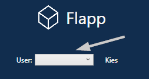
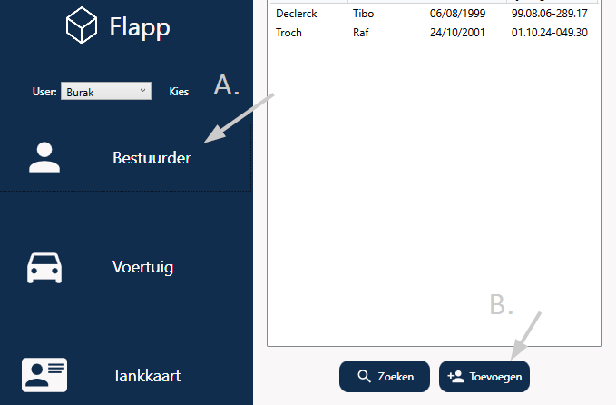
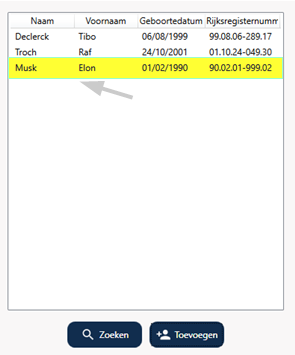

##  Flapp Documentatie

### Voeg bestuurder documentatie

1. Kies een [connctie](../ConnectieStrDoc.md), dat u heeft gemaakt.

   

2. Nadat je een verbinding heeft gekozen, klik je op (A.) **Bestuurder**.
    Nu krijg je de bestuurders in een lijst, onder de lijst heb je een knop (B.) **Toevoegen**.

   

3. Je krijgt een toevoegingsscherm te zien, waar je alle gevraagde gegevens invult en dan op toevoegen drukt.
   

4. Nu krijg je _Elon Musk_ in de bestuurders lijst.

   
