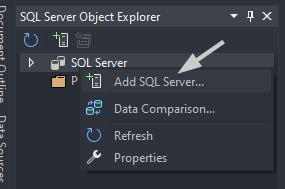
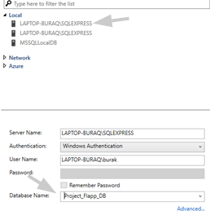
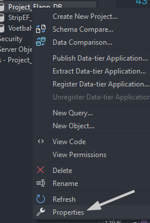
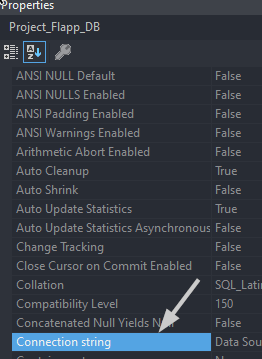

## Flapp Documentatie

### Connectiestring instellen

1. Open [SMSS](## 'SQL Server Management Studio').

2. Open **SQL Server Object Explorer**. (View -> SQL Server Object Explorer)

   Rechts klik op _SQL Server_ als je nog geen connectie hebt.
   

3. Duid in local een server aan met _SQLEXPRESS_ en hier na duid je ook de database aan.

   

4. Nu is de _SQL Server_ zichtbaar. Klik ze open en zoek de database, druk daarna rechts voor **Properties**.

   

5. Een properties zijbalk zal openen met de connection string, kopieer het

   
