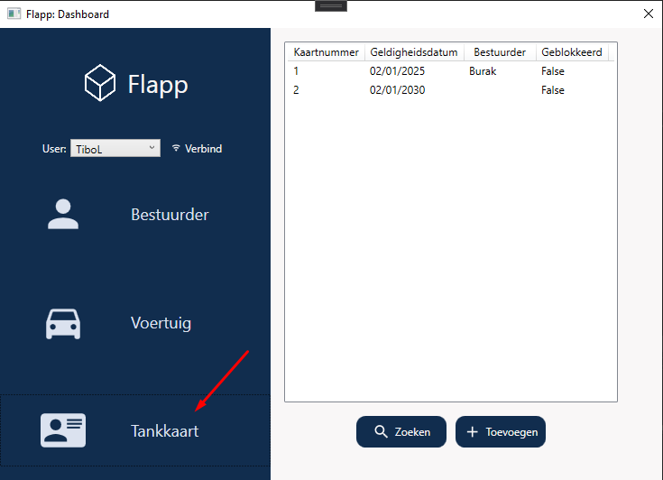
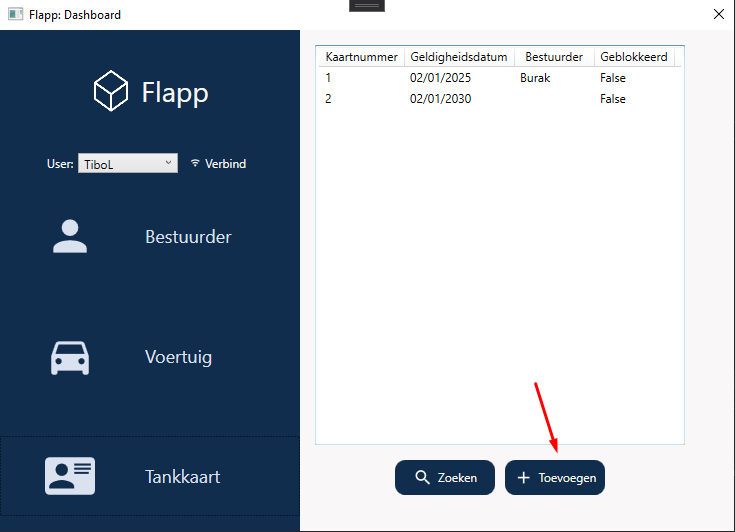
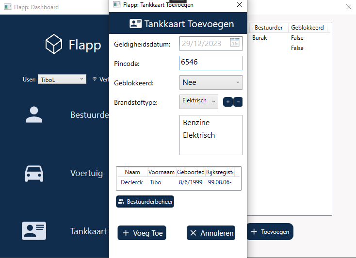
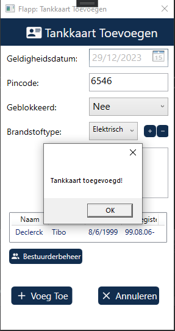
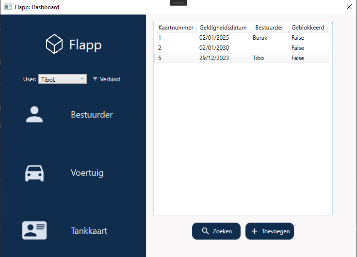

##  Flapp Documentatie

### VoegTankkaartToe documentatie

1. Druk op de knop "Tankkaart"!

   

2. Druk op de knop "Toevoegen"!

   

3. Vul de velden in!

   

4. Als u drukt op toevoegen verschijnt er een venster indien het gelukt is

   

5. U ziet nu uw nieuwe tankkaart bij de rest staan!

   