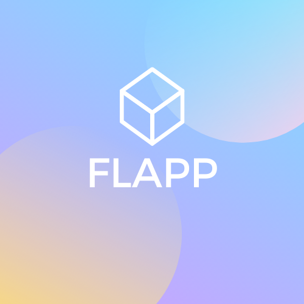

<!-- # Project_Flapp
### Fleet Management App -->
<!--  -->
<!-- PROJECT LOGO -->
 

    

  <h3 align="center">Fleet Management App</h3>

  

    Logboeken van de contributors
     
     
    <a href="./BurakLogboek.md">Burak Balci</a>
    ·
    <a href="./RafLogboek.md">Raf Troch</a>
    ·
    <a href="./TiboLogboek.md">Tibo Declerck</a>
  

<!-- Feedback -->
<!-- [ ] Empty [x] Full -->

## Feedback: Les 2

- [ ] Deadline -> 12 weken
- [x] RijksregisternummerChecker
- [ ] ChasisnummerChecker
- [ ] NummerplaatChecker
- [x] Github Commits
- [ ] Exceptions opkuisen
- [x] Adres, Brandstof, RijbewijsType -> _Models_
